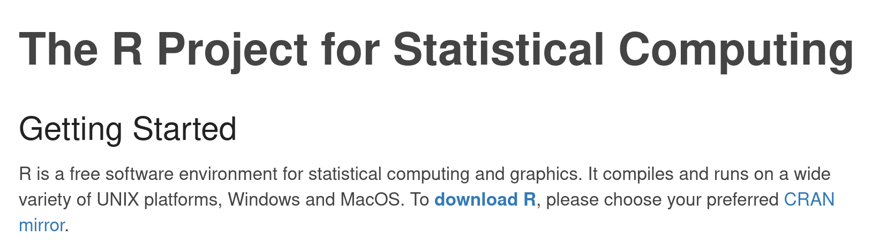

```{r setup, include=FALSE}
knitr::opts_chunk$set(echo = TRUE)
```

## What is this guide?

This guide attempts to give a short guide (3-5 pages) to the basic use of RStudio. The idea is that students can self-learn the basic user interface and most commonly needed knowledge to independently use RStudio on a first statistics courses. This material is free to use and edit.

## Introduction

RStudio is a graphical user interface to R. The RStudio makes it much easier to learn R and manage R programming code.

## User interface

## Installing and updating RStudio

To install RStudio you first need to have R installed. Here is a brief guide how to install R.

### Installing R

1. Go to http://www.r-project.org
2. Click download R (see Figure 1) 
3. Click one of the mirror links, e.g. if you want to download from Austria server, choose https://cran.wu.ac.at/
4. Choose your operating system (usually Windows). See Figure 2.

**Note!** From now on the installation instructions are different for different operating systems. We will follow instructions for isnstalling R to Windows. For Mac or Linux follow the advice on the web page or ask for help.

5. Click **install R for the first time**.
6. Click the first link on the page. At the moment of writing it is: **Download R 4.1.2 for Windows (86 megabytes, 32/64 bit)** The version number is likely to change with time.

{width=50%}
{width=50%}

## Opening and closing RStudio

## Tuning RStudio settings

## Installing, updating and loading R packages

## Creating an R script and running code

## Saving an R script

## RStudio projects

## Quick commands
CTRL+R run line or selection
CTRL+SHIFT+C comment/comment out
CTRL+C copy
CTRL+V paste
